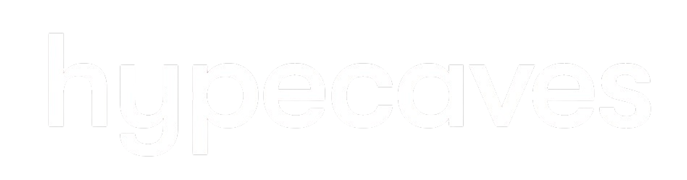

  <a href="https://instagram.com/hypecavess">
<picture>
  
</picture>

  </a>

‎ 

‎ 

  <h2 align="center">What I Do?‎‎ '24 "52 `08</h2>

  

  * I design and engineer <strong>high-quality, production-ready web products</strong>
    with a strong focus on <strong>front-end architecture</strong>,
    <strong>design systems</strong>, and <strong>network-aware application design</strong>.
  

  

  * My expertise lies in building interfaces that are not only visually refined,
    but also <strong>scalable, maintainable, and system-driven</strong>.
    I approach every product as a long-term system rather than a short-lived interface.
  

  
  

  * As the founder of <strong>Nothinger</strong>, I build and maintain
    systems that prioritize <strong>developer experience</strong>,
    <strong>visual coherence</strong>, and <strong>engineering standards</strong>,
    often operating behind private infrastructures by design.
  

