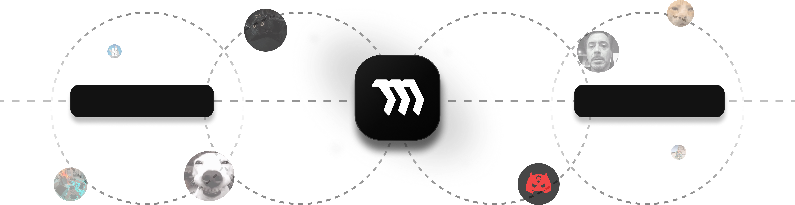

  <h2>08, Front-End & MERN & Protocol</h2>
  <h4>Graphic and UI/UX Design</h4>
Hello, I'm HypeCaves. I've been actively working in the software industry for eight years. I'm a high school student and receiving vocational training. I develop mostly web-based projects. I'm also the founder of my own software company, Nothinger. I also do graphic design and UI/UX design.

   

  <h2>Skills</h2>
  

    
  

   

  <h2>Works</h2>

<table>
<tr>
<td width="55%">

<h3>Nothinger, INC.</h3>

Project development and improvement company with the widest range of services in Türkiye.
‎

</td>
<td width="45%" align="center">

</td>
</tr>
</table>

</td>
</tr>
</table>
